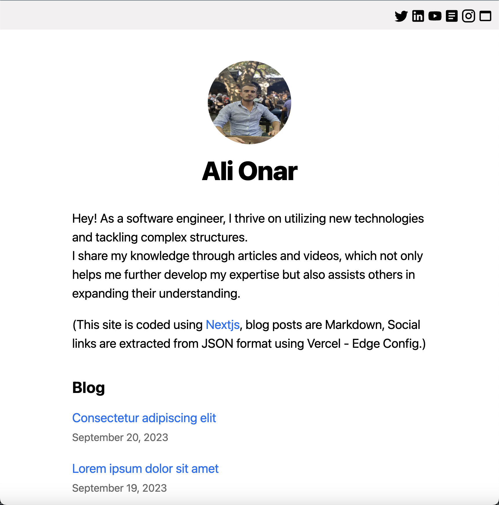
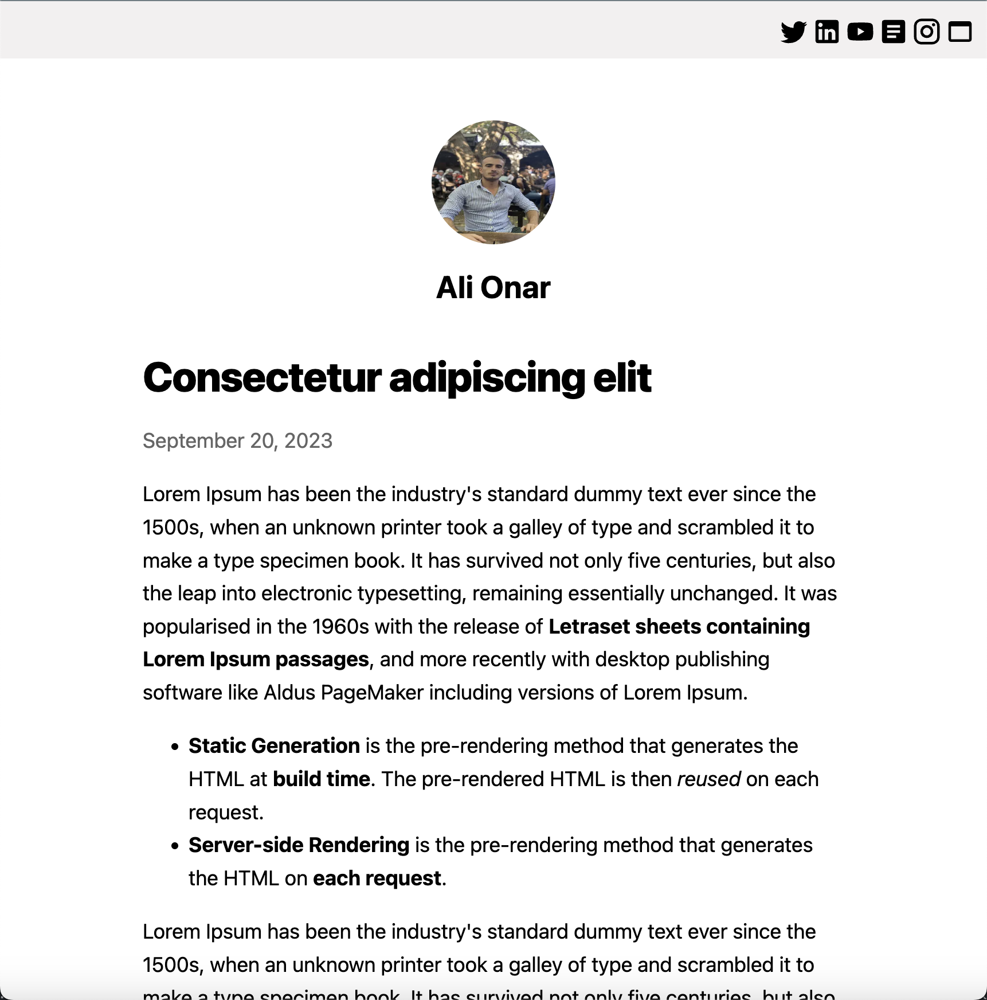

## Nextjs - Markdown Blog App

Demo: [`simple-blog-app`](https://linktree-rho-peach.vercel.app/).

A simple version of this project using "Pages Router" is described in the [Nextjs Learn](https://nextjs.org/learn/basics/create-nextjs-app) documentation.

**JSON Data Format**
```json
{
  "data": {
    "name": "Your Name",
    "avatar": "if you want -> image alt name",
    "avatarUrl": "if you want -> image url",
    "socials": [
      {
        "title": "Twitter",
        "url": "Your twitter url"
      },
      {
        "title": "Linkedin",
        "url": "Your Linkedin url"
      },
      {
        "title": "Youtube",
        "url": "Your Youtube url"
      },
      {
        "title": "Medium",
        "url": "Your Medium url"
      },
      {
        "title": "Instagram",
        "url": "Your Instagram url"
      },
      {
        "title": "Website",
        "url": "Your Website url"
      }
    ]
  }
}
```

- First create Edge Config on the Storage page in Vercel. Then follow the instructions there to customise the following JSON file and save it. I used Edge Config to host the JSON file on the remote server.

- Alternatively, if you don't want to use Edge Config, create data.json in the most external directory of the project and save this file. If you prefer the alternative way, don't forget to change the data import format in `components/navbar.js` file!

Run the development server:

```bash
npm install
# then
npm run dev
# or
yarn dev
# or
pnpm dev
```

**Project Pages:**



Open [http://localhost:3000](http://localhost:3000) with your browser to see the result.
